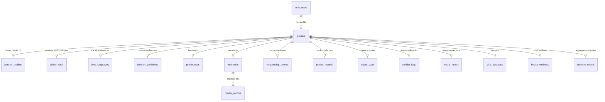

# Database Relationships Diagram — THE KRISHA ARCHIVE

This document presents a visual mapping of the PostgreSQL tables and their relational links. All records are scoped to individual users.

## Relational Summary

1. **`auth.users`** (Supabase Auth Core):
   - The absolute root of identity. All user tables reference this via foreign keys (`user_id` -> `profiles.id`).
   
2. **`profiles`** & **`partner_profiles`**:
   - Represents the core relationship context. `partner_profiles` has a `unique` constraint on `user_id` to enforce a 1-to-1 mapping for the partner details (Krisha).

3. **`timeline_events`**:
   - Acts as a unified index. PostgreSQL database triggers on `memories`, `relationship_events`, `quote_vault`, `conflict_logs`, and `gifts_database` copy relevant records directly into `timeline_events` on transaction commit, avoiding expensive multi-table joins.

4. **`memories`** & **`media_archive`**:
   - 1-to-many relationship. Any memory entry can bind multiple media types (images, voice notes, video) stored in the Supabase Storage Bucket.
